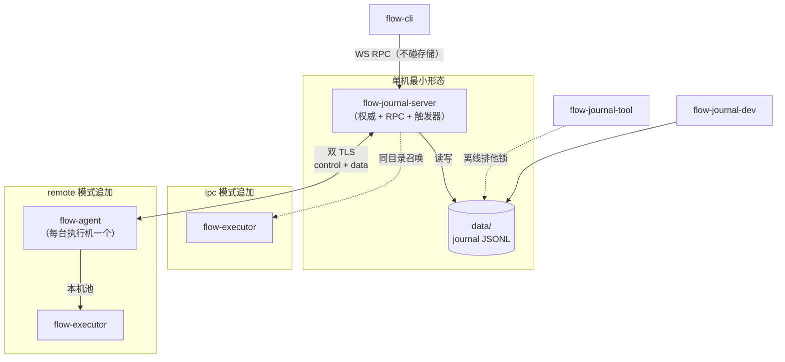

# flow 运维手册

> 状态：**当前代码实际语义**（2026-10-10）。覆盖进程关系、单机/多机部署、三种执行
> 模式、启动重启终止、离线维护、升级、故障处置、容量与安全边界。
>
> 关联文档：
>
> - 引擎与协议语义（权威）：[DESIGN.md](DESIGN.md)
> - journal v2 开发入口与 RPC 契约：[JSONL_DEVELOPMENT.md](JSONL_DEVELOPMENT.md)
> - v1 SQLite → v2 切换与行为差异：[SQLITE_V1_TO_V2_MIGRATION.md](SQLITE_V1_TO_V2_MIGRATION.md)
> - 配置项全量说明：[../flow.config.example.toml](../flow.config.example.toml) +
>   `crates/flow-config/src/lib.rs`

## 0. 运维速查

| 场景 | 动作 | 详见 |
| --- | --- | --- |
| 单机起服务 | `flow-journal-server`（缺省 journal 后端） | §1.2 |
| 单机 + 进程隔离 | `mode = "ipc"`，`flow-executor` 与主进程同目录 | §1.2、§2.2 |
| 多机执行扩容 | `mode = "remote"`，每台执行机一个 `flow-agent` | §1.1、§2.3 |
| PostgreSQL 库 | 保留库与测试；V1 产品服务已退役 | §1.3 |
| 产品服务 | `flow-journal-server`，完整 V2 产品面 | §3.5 |
| 优雅停机 | `kill -INT <pid>`（**不是** SIGTERM，见下） | §5.1 |
| 重启 | `kill -INT` → 等端口/锁释放 → 起新进程 | §5.3 |
| 下线一台执行机 | `kill -TERM` 该机 `flow-agent` | §5.1、§5.4 |
| 磁盘维护 | 先停服务，再 `flow-journal-tool verify / rebuild-index / backup / repair` | §4 |
| 重建投影 | `flow-journal-dev --data-dir <dir> rebuild-projection --destination <新文件>` | §4 |
| 升级 | 停 agent → 换主进程二进制 → 重启；journal 只增不删 | §5.4、§6 |
| 只读保全 v1 历史 | `flow-journal-dev --data-dir <新目录> import-legacy --source <旧根> --database <旧>/flow.db` | §4 |

> ⚠️ **`flow-journal-server` 不监听 SIGTERM**：`kill <pid>`（默认 SIGTERM）会跳过 checkpoint
> 与投影关闭直接终止。优雅停机必须 `kill -INT`。`flow-agent` 两者都监听。

---

## 1. 部署形态

### 1.1 产品二进制与它们的关系



**谁是权威**：`flow-journal-server`（journal 后端时）是唯一写者与提交者。`flow-executor`
只做计算、不产生权威 ACK/Permit；`flow-agent` 只做中继与容量扩展。**`flow-cli` 是
纯 RPC 客户端，不碰任何存储**——CRUD 与触发语义唯一来源是服务端那一份。

| 进程 | 归谁管 | 生命周期 |
| --- | --- | --- |
| `flow-journal-server` | 运维 / systemd / 手起 | 常驻主进程 |
| `flow-agent` | 运维（每台执行机） | 常驻，断线退避重连 |
| `flow-executor` | **由 `flow-journal-server` 或 `flow-agent` 召唤**，不手起 | 随任务/会话回收 |
| `flow-cli` | 人手 | 一次性 |
| `flow-journal-tool` / `flow-journal-dev` | 人手（须停写） | 一次性 |

`flow-executor` **不是独立部署单元**：主进程缺省在**自身同目录**定位兄弟
`flow-executor`（`FLOW_EXECUTOR_BIN` 可显式覆盖），找不到即报错，绝不静默回退
进程内执行。所以部署形态永远是「同一目录里放齐需要的二进制」——
`scripts/build-journal.sh` 的 `dist/journal/bin/` 就是这件事。

`flow-journal-server` 装配完整 V2 产品面，方法与认证约定见 §3.5。

### 1.2 单机（journal 后端，缺省）

journal 是唯一权威：`<data_dir>/journal/NNNNNNNN.jsonl` 段文件 + `checkpoints/` +
`indexes/` + `observations/`；`<data_dir>/projection.sqlite` 只是可随时删除重建的
投影。**目录布局**：

```text
<data_dir>/
  journal/            权威段（0700 dir / 0600 文件）
  checkpoints/        恢复检查点（latest.json）
  indexes/            locations.jsonl（派生索引，可删）
  observations/       可丢失观测（可删）
  projection.sqlite   投影（可删；rebuild-projection 重建）
```

Journal 根使用 `[journal].data_dir` / `FLOW_JOURNAL_DATA_DIR`；加密密钥放在
`[storage].data_dir` / `FLOW_DATA_DIR`。初次创建的 Journal 根必须为空，密钥目录应独立。

启动：

```sh
export FLOW_JOURNAL_TOKEN="<至少32字节的部署令牌>"
export FLOW_JOURNAL_DATA_DIR=/var/lib/flow/journal-v2
export FLOW_DATA_DIR=/var/lib/flow/secrets
flow-journal-server
flow-journal-server --config /etc/flow/flow.toml
```

监听缺省：RPC `127.0.0.1:9802`、webhook HTTP `127.0.0.1:9803`、cron 调度开。
**v1 布局目录（有 `flow.db`、无 `journal/`）在 journal 模式下拒绝启动**——历史数据
不迁移，防混用护栏。

#### 单机进程矩阵

| 执行模式 | 需启动的进程 | 说明 |
| --- | --- | --- |
| `in_process`（缺省） | 只 `flow-journal-server` | 无子进程，节点在服务进程内执行 |
| `ipc` | `flow-journal-server`（同目录备好 `flow-executor`） | `flow-executor` 由主进程按需召唤 |
| `remote` | `flow-journal-server` + 每台执行机 `flow-agent` | 执行机上也需 `flow-executor` |

单机 `ipc` 的完整形态（生产常用，隔离节点执行但不必跨机）：

```sh
# bin/ 目录内：flow-journal-server + flow-executor 同目录
cat > flow.toml <<'EOF'
[storage]
backend = "journal"
data_dir = "/var/lib/flow/secrets"

[journal]
data_dir = "/var/lib/flow/journal-v2"

[execution]
mode = "ipc"
x_max = 4
EOF
./bin/flow-journal-server --config ./flow.toml
```

### 1.3 PostgreSQL 后端

v1 的 PostgreSQL 后端（`flow-pg` crate、`[pg]` 配置段与 PG 测试臂）已整体
删除；当前产品统一装配 Journal。多机计算使用一个 Journal 主进程与多个
远程 agent（§2.3）。

### 1.4 打包

```sh
scripts/build-journal.sh    # → dist/journal/（唯一打包入口）
```

产物 `dist/journal/bin/` 内全部二进制同目录。入口 `run-server.sh` 要求
`FLOW_JOURNAL_TOKEN`，缺省使用独立的 `journal/` 与 `secrets/` 目录及 9802/9803 端口。
受 Xcode 21 `ld` LINKEDIT bug 影响的机器用 `scripts/release.sh cargo ...` 包装
（自动切 rust-lld），默认构建不变。

---

## 2. 执行模式

同一数据集单写者；一个 run 只绑定一种执行模式；`master_epoch` 随执行启动持久提交。
模式缺失资源（ipc 无执行器、remote 缺 `[execution.remote]`）**直接失败，不静默
回退进程内**——「进程隔离/远程执行」的部署承诺不能被空气化。

### 2.1 in_process（缺省）

节点在服务进程内执行。`[execution] mode = "in_process"`。适合低隔离要求的内部部署。

### 2.2 ipc（本机执行子进程）

模板 / script / condition / HTTP 全部在 `flow-executor` 子进程内执行；journal 语义
与进程内模式逐字节同构。

```toml
[execution]
mode = "ipc"
x_max = 4            # 执行槽位 1..=16
```

执行器定位：`[execution] executor_bin` 显式路径 → 当前可执行文件同目录的兄弟
`flow-executor`（`FLOW_EXECUTOR_BIN` 同义）。找不到即报错。**部署形态就是
「主进程与 `flow-executor` 同目录」**，脚本产物默认满足。

握手失败（二进制缺失 / 版本不兼容 / 缺能力 `execute`/`js`/`http`/`transfer`）明确
失败，不降级。

### 2.3 remote（远程 agent 中继）

agent 只扩展**计算容量**，不扩展 journal 耐久吞吐，不提供主进程高可用。

主进程侧：

```toml
[execution]
mode = "remote"
x_max = 4

[execution.remote]
control_addr = "10.0.0.8:9700"
data_addr    = "10.0.0.8:9701"
ca_cert   = "/etc/flow/ca.pem"
cert      = "/etc/flow/server.pem"
key       = "/etc/flow/server.key"
attach_timeout_ms = 120000    # 断链后等 agent 重连对账的总时限
```

每台执行机侧（`flow-agent` + `flow-executor` 同目录）：

```sh
flow-agent --control-addr 10.0.0.8:9700 --data-addr 10.0.0.8:9701 \
  --agent-id agent-a --ca-cert ca.pem --cert agent-a.pem \
  --key agent-a.key --slots 4
```

等价配置（`[agent]` 分区，flag > env > 配置文件 > 报错）：

```toml
[agent]
control_addr = "10.0.0.8:9700"
data_addr    = "10.0.0.8:9701"
agent_id     = "agent-a"
ca_cert = "/etc/flow/ca.pem"
cert    = "/etc/flow/agent-a.pem"
key     = "/etc/flow/agent-a.key"
slots   = 4
# executor_bin 缺省定位同目录 flow-executor；FLOW_EXECUTOR_BIN 亦可覆盖
```

#### 证书与身份（mTLS 是安全边界，不是可选项）

- PKI：内部 CA 签发 server 证书与每台 agent 证书。**证书 CN 即 agent_id**：主进程
  从 TLS 客户端证书取 CN，不信 agent 自报字段。
- 双连接：control（握手 / 管理帧 / Resume / Drain）+ data（业务帧）。AgentWelcome
  下发一次性 `data_credential`，DataBind 校验同 TLS 主体 + `agent_boot_id` +
  `link_session_id`；凭据一次性，连接替换后旧绑定作废。
- 协议版本：`PROTOCOL_VERSION = 1`，帧信封 `v` 不符即拒。agent 必报能力
  `relay` / `resource_report` / `reconnect`；缺一即拒。
- 凭证：业务密钥以最小引用经 OperationPermit 按任务下发（主进程解析，**不复制主
  进程环境到 agent**；凭证值不进入授权事实，不进 journal）。

#### 多机部署拓扑

```text
            ┌──────────────────────────────┐
            │  主进程机器（1 台）           │
            │  flow-journal-server（mode=remote）   │
            │  data_dir/journal ← 唯一权威  │
            └───────────┬──────────────────┘
                        │ control :9700 + data :9701（mTLS）
        ┌───────────────┼───────────────┐
        ▼               ▼               ▼
  ┌──────────┐    ┌──────────┐    ┌──────────┐
  │ agent-a  │    │ agent-b  │    │ agent-c  │
  │ flow-    │    │ flow-    │    │ flow-    │
  │ agent    │    │ agent    │    │ agent    │
  │ + exec   │    │ + exec   │    │ + exec   │
  │ slots=4  │    │ slots=4  │    │ slots=4  │
  └──────────┘    └──────────┘    └──────────┘
   执行机 A         执行机 B         执行机 C
```

部署清单：

| 机器 | 进程 | 数据 | 网络 |
| --- | --- | --- | --- |
| 主进程 1 台 | `flow-journal-server` | **持有 `data_dir`（journal 权威）** | 出站到各 agent；入站 RPC 9802 / webhook 9803 |
| 每台执行机 | `flow-agent` + `flow-executor`（同目录） | 无持久数据 | 出站到主进程 9700/9701 |

要点：

- **agent 数与容量**：全局活跃派发上限 `A_max = 16`，每 agent 由 `--slots` 报容量
  （缺省 4）。主进程按「已绑定占用 < 该 agent slots」准入，报告有延迟也不重复超配。
- **主进程仍是单点**：agent 只扩算力。主进程重启 = epoch 变化，agent 重连后按
  Resume 裁决恢复（§7.3）。
- **一台执行机整体丢失**：其未确认数据可能丢失，主进程保留已确认前缀并标
  incomplete，不生成成功结果；其他机器任务不受影响。
- **执行机无需共享 `data_dir`**：业务值经 data 通道传输，agent 不落权威副本。
- remote 模式保持一个 Journal 权威主进程，多个 agent 提供无状态执行容量。

---

## 3. 日常运行

### 3.1 启动顺序（journal 后端，`flow_rpc::serve_journal_product`）

```text
Config::load（构造 runtime 之前）
  → JournalBackend::open（恢复权威状态与投影）
  → HTTP 装配（值下载 + POST /hooks/<key>）
  → ConfigState / 密钥存储 / V2 产品 RPC 装配
  → serve_product（JSON-RPC WebSocket）
  → start_execution（按 [execution] 启动执行驱动）
  → journal_triggers（cron tick，journal_trigger_tick_secs）
  → 等 Ctrl-C → 停触发器 → 停 RPC → 停 HTTP → backend.close
```

### 3.2 触发器

- cron：`[server] scheduler_enabled` / `journal_trigger_tick_secs`（journal 臂）。
  触发身份 = 命令身份，天然去重，无 `schedule_fires` 表。
- webhook：journal 后端 `POST /hooks/<id>`（Bearer token + 稳定 `Idempotency-Key`，
  body 为 JSON input，上限 8 MiB）。认证失败 → 401；缺失幂等键、非法 body、
  未知/禁用触发器或无 published 版本 → 400。成功返回原生提交回执。

### 3.3 值读取（大值下载）

journal 后端提供有界流式下载：`GET /runs/<run_id>/values/<output_id>`，
`Authorization: Bearer <token>`。引用必须出现在该 run 当前投影中，以该投影 LSN 为
读取上界。最多 8 个并发下载，每个 4 块有界队列，断连释放读取任务，响应不缓存，
不支持 Range。下载端口强制 loopback（`journal.http_addr` 校验）。
`flow-cli journal download` 与前端 /journal 页面走同一路径。

### 3.4 密钥与凭据

- 业务密钥：Web 设置页或 `secrets.set/delete` → `<data_dir>/secrets.json`
  （AES-256-GCM，主密钥 `<data_dir>/secret.key` 随机 32B，unix 0600）。
  stored 优先、env 兜底。主密钥丢失 = 解密失败 = 未配置，不炸进程，但 stored 值全部
  不可恢复。
- journal token：仅环境变量 `FLOW_JOURNAL_TOKEN`（≥32 字节），**不进配置文件**。
- `FLOW_SECRET_*`：进程级 env 兜底来源。
- 不在配置文件里的东西：`RUST_LOG`、`FLOW_SECRET_*`、`FLOW_JOURNAL_TOKEN`、
  执行协议冻结常量（`contract.rs`）、executor FD 槽位、`FLOW_RUN_LOG_BUDGET` 等
  engine 内部预算。

### 3.5 V2 产品服务与客户端契约

`flow-journal-server` 是唯一产品服务；旧 `flow-server` 与 V1 RPC 注册层已删除。
浏览器、桌面、CLI、backend-e2e 与 backend-perf 使用同一套 V2 产品方法。
桌面通过进程内调用 `journal_v2::module_product`，按统一执行配置启动驱动。

| 接入面 | 方法或约定 |
| --- | --- |
| 认证 | RPC 每请求 `_token`；HTTP `Authorization: Bearer ...`；部署 token 通过 `FLOW_JOURNAL_TOKEN` 提供，至少 32 字节 |
| 写命令 | workflow / run / schedule / webhook / template 写方法必须携带稳定 `request_id`；成功返回完整提交回执 |
| 回执 | `{committed, visible, request_id, commit_cursor, result}`；`-32020` 表示已提交未可见，按原 scope/身份查询 `command.status` |
| 原生读面 | `workflow.get/list`、`run.get/list`、事件/审计游标分页、`legacy.get/list` |
| 物化读面 | `workflow.get.full/list.full/versions`、`run.get.full/list.full/stats/timeline/events.full` |
| 产品配置 | schedule / webhook / template CRUD、`nodetypes.list`、`config.get/update`、`secrets.list/set/delete` |
| 订阅 | `run.subscribe` 必须指定 run；原生格式 `event_format=v2`，主工作台门面用 `envelope` |
| 独立日志 | `run.observations.page`，浏览器 `/journal` 展示；主工作台旧 node_log 控制台仍为空 |
| Webhook | `POST /hooks/<key>`，Bearer + 稳定 `Idempotency-Key`；返回原生提交回执 |
| 值下载 | `GET /runs/<run_id>/values/<output_id>`，Bearer 认证 |

主工作台及普通 CLI 解包已提交回执为 `result`；`/journal` 与 CLI 的 journal
子命令保留完整协议。浏览器缺省连接 9802/9803，访问令牌可通过 `config.json`、
`VITE_FLOW_TOKEN` 或设置页配置；用户在设置页保存的令牌优先。

外部副作用失败仍进入 uncertain 等人工裁决；裁决用 `run.adjudicate`，也保留
`run.signal` 的 `payload.action` 桥接。日志与墙钟差异见迁移文档 §3。

---

## 4. 离线维护

**所有离线工具先取数据目录排他锁：持有锁的服务必须先停。** 工具不执行用户代码、
不发网络请求。

```sh
# 1) 全量字节校验 + 已发布值闭环
flow-journal-tool verify ./data

# 2) 重建位置索引（派生缓存，可随时删除）
flow-journal-tool rebuild-index ./data

# 3) 备份可恢复前缀到新目录
flow-journal-tool backup ./data ./backup

# 4) 报告可恢复前缀（非零退出码结束）
flow-journal-tool repair ./data ./repaired
#    确认后才写新目录；原数据永不修改
flow-journal-tool repair ./data ./repaired --confirm

# 5) 投影重建到新的 SQLite 文件（目标必须不存在）
flow-journal-dev --data-dir ./data rebuild-projection --destination ./rebuilt.sqlite
```

- **repair 不是无损清理**：候选后缀可能包含曾被确认的提交。它把可恢复前缀写进
  **新目录**并保留原文件作为证据，绝不声称缺失后缀从未被确认。
- `rebuild-projection` 目标必须不存在；失败时保留目标供排查，不当作完成的投影。
- 备份清单里未发布的 `.flow-copy-*` 不属于权威记录，确认无导入进程后可人工清理。
- 备份清单 / 外部确认游标发现领先位置时停止自动恢复——本地单副本不承诺检测所有
  历史回退。

### 历史数据保全（只读，不迁移）

```sh
flow-journal-dev --data-dir ./new-v2 import-legacy --source ./old-root --database ./old-root/flow.db
```

导入前停写；锁定源目录并校验清单；目标须为独立目录；同源同目标可重试，源变化则
拒绝。导入的基线走只读 `legacy.get/list`，旧 run 不自动续跑，触发器默认禁用。

---

## 5. 进程生命周期：启动、重启、终止

### 5.1 各进程的信号处理

| 进程 | SIGINT / SIGTERM 行为 | 收到后的收尾 |
| --- | --- | --- |
| `flow-journal-server` | **只处理 Ctrl-C**（`tokio::signal::ctrl_c`） | 停触发器 → `server.stop()` → 5s 内等下载任务（超时 abort）→ `backend.close()` |
| `flow-journal-dev` | Ctrl-C 打断等待循环 | 直接 break 后 `backend.close()`；`run`/`resume` 的等待中 run 保持未终态 |
| `flow-agent` | **处理 SIGTERM 与 Ctrl-C**（unix 双监听） | `cancel_all`（取消本地执行器）→ 关上联 → 退出，reason 打印为 `shutdown` |
| `flow-executor` | 无信号处理，随通道 EOF 退出 | 任一通道 EOF → 取消当前任务 → 尽力发 `Stopped` → 退出码 0（主进程不可达 74 / 任务 panic 75，供父进程诊断） |

**关键不对称**：`flow-journal-server` **不监听 SIGTERM**——用
`kill <pid>`（默认 SIGTERM）不会触发优雅停机，进程会被默认动作直接终止，
**跳过 checkpoint 与投影关闭**。所以：

```sh
# 正确：优雅停机
kill -INT <pid>          # 或 kill -TERM 对 flow-agent

# 也可以用 supervisor 发 SIGINT
systemctl stop flow      # 需在 unit 里配 KillSignal=SIGINT
```

SIGKILL（`kill -9`）跳过全部收尾。**journal 仍然安全**——权威是 append-only
JSONL，已提交事实不丢；代价是丢一次 checkpoint，下次启动多一次全量重放，以及
`projection.sqlite` 可能停在落后位置（下次 open 时追平）。

### 5.2 重启前的数据安全边界

journal 后端启动时对 `data_dir` 持**排他 flock**（`Disk::open`）：

- 第二个实例立即失败（`data directory is locked`），不会双写；
- 所以「重启」= 旧进程退出并释放锁 → 新进程拿锁。**不要在旧进程还活着时起新进程**；
- 离线工具（verify/backup/repair）同样要这把锁，**因此跑离线维护必须先停服务**。

进程退出后残留的 `flow-executor` 由 `kill_on_drop` 兜底回收（父进程消失即被杀），
不会变孤儿继续跑用户代码。

### 5.3 标准重启流程

```sh
# 0) 可选：先看有没有 awaiting_resume 的 run 待人工裁决
flow-cli --url ws://127.0.0.1:9802 run list --status awaiting_resume

# 1) 优雅停机（等日志出现「收到中断信号，正在停止」后退出）
kill -INT "$(pgrep -f 'flow-journal-server')"

# 2) 确认端口与锁已释放
lsof -nP -iTCP:9802 -sTCP:LISTEN      # 应无输出

# 3) 启动新二进制
./bin/flow-journal-server --config /etc/flow/flow.toml
```

重启后自动发生：`Disk::open` 校验段链 → `load_checkpoint` 快路径（仍逐段核对
存在性/身份/长度/边界）→ 不一致则全量 scan → 投影追平 → 执行驱动重启 →
**未终态 run 按 §5.5 规则恢复**（uncertain 不自动重发）。

### 5.4 remote 模式的重启顺序

主进程与 agent 的重启互不等价，**顺序有讲究**：

| 场景 | 操作 | 后果 |
| --- | --- | --- |
| 重启单台执行机 | `kill -TERM` 该机 agent → 替换二进制 → 重启 agent | 该机在飞任务按 Lost 处理，主进程可重新派发；其他 agent 无感 |
| 重启主进程（不换二进制） | `kill -INT` flow-journal-server → 重启 | epoch 不变；agent 重连，Resume 按裁决继续 |
| 主进程升级二进制 | **先 drain 或停 agent** → 换主进程二进制 → 重启 → 再起 agent | agent 以新 `agent_boot_id` 重连；协议/能力不兼容在握手处明确失败 |

**主进程升级时不要留着旧 agent 在线**：新旧协议版本若不兼容，agent 会反复握手失败
并退避重连，刷屏且无法收敛。先停 agent，主进程就绪后再起。

### 5.5 停机窗口里正在跑的 run 会怎样

| 停机时机 | 行为 |
| --- | --- |
| 授权前（Intent 已写、Permit 未发） | 重启后**安全重新派发**——请求从未发出，无副作用风险 |
| 授权后、结果未知 | 进 `uncertain` 等待（`awaiting_resume`），**绝不自动重发**；要人工 `run.adjudicate` |
| 结果已提交 | 重放识别为 `AlreadyCommitted`，直接续跑 |
| 等待中（delay/human_task/sub_workflow） | 唤醒时间已过的按续跑逻辑处理；未到点的继续等 |

---

## 6. 升级

### 6.1 二进制与协议

- 执行协议 `PROTOCOL_VERSION = 1`：版本不兼容在握手处明确失败（executor 缺能力 /
  帧 `v` 不符），不降级执行。
- journal 兼容：**只增不删**。新写入只能由能读新 journal 的兼容二进制回退；
  **不能重新启用旧 SQLite 数据库覆盖新事实**。
- 升级顺序（remote 模式）：drain 目标 agent → 替换二进制 → 重启 agent（新
  `agent_boot_id`，Resume 对账后按裁决继续/取消）→ 主进程。停机/启动细节见 §5.4。

### 6.2 drain 语义

主进程对 agent 发 `Drain { grace_ms }`（上限 `DRAIN_GRACE_MS = 5s`）：agent 停止
接新派发 → 取消在飞 → 转发最后确认 → `DrainComplete` → 退出上联。之后新派发到该
agent 明确失败。drain 期间其他 agent 不受影响。

**当前没有 CLI / RPC 的 drain 入口**：`AgentManager::drain(agent_id, grace_ms)` 是
库 API（测试 `journal_remote_ops.rs` 消费）。要下线一台执行机的现实路径：
`kill -TERM` 该机的 `flow-agent`（§5.1）——其在飞任务按 §7 的失联规则处理，
已确认事实不受影响。

### 6.3 观测与日志的兼容边界

新二进制写的 NodeLog / 观测事件旧二进制读会反序列化失败。单二进制部署、升级时
排空运行中 run 即无此场景；不做兼容层。

---

## 7. 故障处置

### 7.1 agent 失联

任务挂起等 Resume（`attach_timeout` 后失败封口）。已授权未封口的操作按 uncertain
规则保留；缺口与 uncertain 按 §7.5 处理。**其他机器任务不受影响。**

### 7.2 agent 崩溃 / 被杀

执行器随本地通道 EOF 退出；任务按 Lost 失败封口，重试由主进程新派发执行。

### 7.3 主进程重启（epoch 变化）

agent 重连 → Resume 上报本地未决事实 → 主进程**以 journal 为准**裁决（不信 agent
自报游标）：

| 裁决 | 触发条件 | 处置 |
| --- | --- | --- |
| `AlreadyCommitted` | 该 attempt 已有 result | 上传既有结果，不重跑 |
| `UploadOnly` | boot 一致、无缺口 | 补传审计，权威游标由重挂后的 ack 流传达 |
| `SubmitExistingResult` | 本地有 result_id | 提交既有结果 |
| `CancelAndDrain` | run 终态 / 派发被替代 | 取消并收尾 |
| `ReconcileRequired` | boot 不符，或数据缺口且无封口结果 | 保守取消，等人工核对 |

未上报的该 agent 绑定判 Lost（执行器已失联）。主进程重启本身不丢已提交事实。

### 7.4 journal 尾部损坏 / 满盘

- 启动时 `load_checkpoint` 快路径仍校验每个已知段的存在性、身份、长度与检查点边界；
  不一致走全量 scan。完整事务按已提交处理；摘要错误 / 段缺失 / 错序 / 封口段损坏
  **停止自动恢复，不跳过**。
- 满盘（errno 28）：提交失败后继续提交仍失败，`durable_lsn` 不越过原回执；歧义尾
  保留，可经新目录 repair 读取。备份目标盘满不损坏权威。
- 初始化中断：`initializing` 行配有有效 `run_started` 时按 §5.5 分类恢复；日志缺失 /
  空文件 / 首行残缺 → 初始化标 failed，保留文件与诊断，不执行节点。

### 7.5 uncertain（未知外部结果）

授权已发出但结果未知时：节点进 `uncertain` 等待（run 状态 `awaiting_resume`），
**绝不自动重发已授权的外部操作**。人工用 `run.adjudicate` 决策：

| decision | 语义 |
| --- | --- |
| `accept_output` | 人工接受产出（不伪造外部响应被捕获） |
| `retry` | 人工显式授权重发——重放再失败/超时仍回 uncertain |
| `failed` | 人工判定失败，节点终态 failed |

裁决不创建声称外部响应已被捕获的 OperationOutcome，也不清除原尝试的 unknown
完整性标记。`awaiting_resume` 就是「需要人工介入」的信号。

### 7.6 平台故障 vs 业务失败

- 引擎内部错误（`EngineError::Bug`）挂 `awaiting_resume`，**不写 `run_failed`**——
  写业务终态会让运维照着没写错的工作流定义白查。错误信息自带卡住的节点与状态。
- 外部操作失败（网络 / 5xx / 超时 / 部分响应）一律 uncertain 等裁决。
- 取消落在授权之后 = outcome uncertain；落在授权之前 = 安全重新派发。

---

## 8. 容量与预算（改配置前先看这里）

| 项 | 值 | 位置 |
| --- | --- | --- |
| 执行槽位 X_max | 缺省 4，可配 1..=16 | `[execution] x_max` |
| 活跃派发 A_max | 16 | `contract.rs` |
| 在飞 run R_max | 1000 | `contract.rs` |
| 持久窗口 W | 2 MiB | `contract.rs` |
| 全局派发预算 | A_max × W × K ≈ 128 MiB | `contract.rs` |
| control / data 帧 | 64 KiB / 1 MiB | `contract.rs` |
| 输入传输块 | 256 KiB，窗口 2 MiB | `contract.rs` |
| 单条 journal 行 | 1 MiB | `flow-journal` |
| 单值 / 内联 / 分块 | 256 MiB / 64 KiB / 256 KiB | `flow-journal` |
| run 输入输出值解析 | 8 MiB | `journal_commands.rs` |
| HTTP 响应体 | 8 MiB（超限判不确定/失败） | `exec.rs` |
| 观测行 / 批 | 16 KiB / 64 行 | `contract.rs` |
| 观测批字节 | DATA_MAX_FRAME / 2 | `contract.rs` |
| agent 上联队列 / 每执行器队列 | 256 / 8 | `flow-agent/relay.rs` |
| agent 窗口 | W × A_max | Welcome 下发 |
| 命令回执幂等窗口 | 最近 8192 条（超窗淘汰） | journal 命令 |
| 下载并发 | 8，每队列 4 块 | `journal_download.rs` |

实测基线（开发机，非生产承诺）：journal 混合负载 projected p99 ≈ 15 ms，RSS ≈ 35 MiB；
1000 在飞 run 恢复 + 取消 ≈ 15.6 s，RSS ≈ 226 MiB。backend-perf（`flow-perf`）可复测。
**agent 断网期间执行中的任务被持久窗口背压冻结**（不提前确认、不无界积压）；
agent 整机丢失时未确认数据可能丢失，主进程保留已确认前缀并标记 incomplete。

---

## 9. 边界（必须向运维明示）

- **主进程是唯一提交者与可用性边界**：agent 只扩展计算容量，不扩展 journal 耐久
  吞吐，不提供主进程高可用。无共享目录 fencing、无日志复制、不宣称 HA。
- **journal 是系统内价值最高的数据存储**，包含用户业务原文（输入/输出全量、可
  流式下载）。读取权限必须显式建模：谁可以读完整值（与 run 读权限同源，不因下载
  接口放宽）、审计与下载路径的鉴权留痕、运维与备份介质的静态加密、日志磁盘访问
  控制。journal token 是**每工作区单口令**，不是多租户授权。
- **本服务没有任何认证/授权**：JSON-RPC WebSocket 谁连上谁就是管理员。默认只听
  loopback；对外暴露必须在外层自备 TLS + 认证（反向代理 / 内网 ACL）。
- `http_call` 是任意出站 HTTP（可打内网与云元数据端点 169.254.169.254），
  `script`/`condition` 是沙箱内任意 JS——**工作流定义事实上是可执行代码**，只允许
  可信用户创建与发布。出站白名单 / 沙箱网络隔离未实现。
- 事件时间是 LSN / run_seq，不是墙钟：`ended_at` 为 null、节点耗时为 0，前端时间
  列显示 1970 / 空。这是 journal 语义，不是 bug。
- 本地单副本不承诺检测所有历史回退：备份清单 / 外部确认游标发现领先位置时必须停止
  自动恢复。
